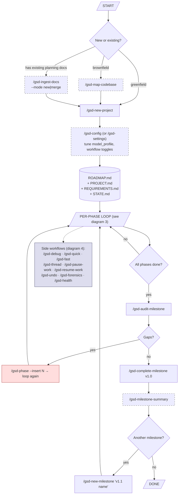
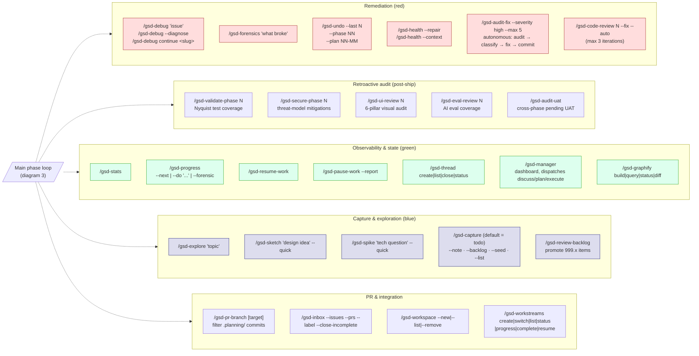
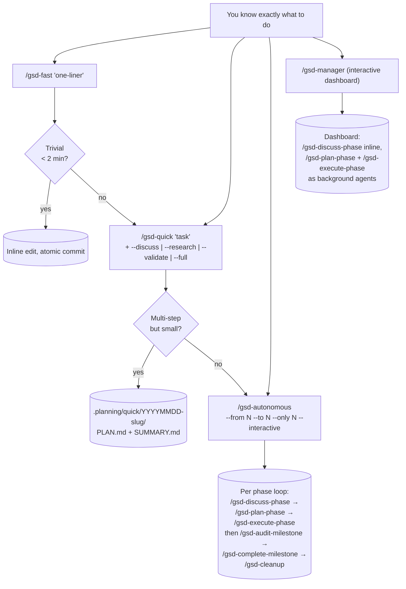

# GSD — Power User Reference (`HELP.md`)

> Generated from a thorough analysis of `commands/gsd/*.md`, `agents/gsd-*.md`,
> and the canonical docs (`README.md`, `docs/USER-GUIDE.md`, `docs/COMMANDS.md`,
> `docs/ARCHITECTURE.md`). All command names use the **hyphen form**
> (`/gsd-foo`) used by Claude Code, Copilot, OpenCode, Kilo, Cursor, Windsurf,
> Augment, Antigravity, Trae. **Gemini CLI uses the colon form** (`/gsd:foo`) —
> the installer rewrites for you, mentally swap the dash for `:` when reading on
> Gemini.

---

## Table of contents

1. [Mental model in 60 seconds](#1-mental-model-in-60-seconds)
2. [Diagram — full project lifecycle (power-user view)](#2-diagram--full-project-lifecycle-power-user-view)
3. [Diagram — main phase loop (per-phase, every optional gate)](#3-diagram--main-phase-loop-per-phase-every-optional-gate)
4. [Diagram — side workflows (remediation, parallel, retroactive)](#4-diagram--side-workflows-remediation-parallel-retroactive)
5. [Diagram — autonomous shortcuts](#5-diagram--autonomous-shortcuts)
6. [Diagram — artifact graph (who writes what, who reads what)](#6-diagram--artifact-graph-who-writes-what-who-reads-what)
7. [Standalone commands (run anytime, no milestone needed)](#7-standalone-commands-run-anytime-no-milestone-needed)
8. [Full command reference (every command, every flag)](#8-full-command-reference-every-command-every-flag)
9. [Namespace routers (one of six)](#9-namespace-routers-one-of-six)
10. [Argument & flag conventions](#10-argument--flag-conventions)

---

## 1. Mental model in 60 seconds

GSD is a thin orchestrator over Claude Code (or OpenCode / Codex / Gemini / Kilo
/ Copilot / Cursor / Windsurf / …). It only does five things:

1. **Initialise** — `/gsd-new-project` (greenfield) or `/gsd-map-codebase` +
   `/gsd-new-project` (brownfield), or `/gsd-ingest-docs` (existing planning
   docs). Produces `.planning/` with `PROJECT.md` + `REQUIREMENTS.md` +
   `ROADMAP.md` + `STATE.md`.
2. **For each phase** — `discuss → (optional design contracts) → plan → execute
   → (optional review) → verify → ship`. Each command writes one artifact the
   next consumes (`CONTEXT.md → RESEARCH.md → PLAN.md → SUMMARY.md →
   VERIFICATION.md → UAT.md → PR`).
3. **Milestone close** — `/gsd-audit-milestone` → `/gsd-complete-milestone` →
   `/gsd-new-milestone` (or stop).
4. **Side-quests** — debug, retroactive audits, cross-AI peer review, undo,
   threads, backlog, quick fixes. These run *off* the main loop.
5. **Aggregators** — `/gsd-autonomous`, `/gsd-manager`, `/gsd-progress --next`
   batch the main loop so you don't have to.

The orchestrator never holds the heavy context — subagents do, each with fresh
~200 k tokens. Artefacts in `.planning/` are the persistent memory.

---

## 2. Diagram — full project lifecycle (power-user view)



**Read the dashed boxes as optional.** Red = remediation. The blue side rail is
the standalone toolkit you can pop into at any moment.

---

## 3. Diagram — main phase loop (per-phase, every optional gate)

```mermaid
flowchart TD
    classDef opt stroke-dasharray: 5 5,stroke:#666
    classDef gate fill:#ffd,stroke:#aa3
    classDef rem fill:#fdd,stroke:#a33

    P0[/"phase N pending<br/>in ROADMAP.md"/] --> SP["/gsd-spec-phase N<br/>SPEC.md (WHAT)"]:::opt
    SP --> DP["/gsd-discuss-phase N<br/>CONTEXT.md (HOW)"]
    P0 --> DP

    DP -- "frontend?" --> UI["/gsd-ui-phase N<br/>UI-SPEC.md"]:::opt
    DP -- "AI/LLM phase?" --> AI["/gsd-ai-integration-phase N<br/>AI-SPEC.md"]:::opt
    DP -- "vertical slice?" --> MVP["/gsd-mvp-phase N<br/>writes **Mode:** mvp"]:::opt
    DP --> PL["/gsd-plan-phase N"]
    UI --> PL
    AI --> PL
    MVP --> PL

    PL -- "research<br/>(Nyquist maps req→test cmd)" --> RES[("RESEARCH.md<br/>VALIDATION.md<br/>= test contract")]
    PL -- "plan<br/>(each task has &lt;verify&gt; block)" --> PLM[("01-01-PLAN.md<br/>01-02-PLAN.md ...")]
    PL -- "verify" --> PLG{plan-checker<br/>passes?<br/>(8th dim: every task<br/>has automated verify)}:::gate
    PLG -- no --> PL
    PLG -- yes --> ALT{Want peer review?}

    ALT -- no --> EX["/gsd-execute-phase N<br/>(--tdd = RED-GREEN order)"]
    ALT -- one shot --> REV["/gsd-review --phase N --all"]:::opt
    REV --> RPL["/gsd-plan-phase N --reviews"]:::opt
    RPL --> EX
    ALT -- loop until no HIGH --> CONV["/gsd-plan-review-convergence N --all"]:::opt
    CONV --> EX
    ALT -- offload to cloud --> UP["/gsd-ultraplan-phase N"]:::opt
    UP --> EX

    EX -- "wave 1 (parallel)<br/>tests + impl per task,<br/>atomic commits" --> S1[("SUMMARY.md<br/>per plan")]
    EX -- "wave 2 ..." --> S1
    EX -- "post-execute verifier" --> V1[("VERIFICATION.md")]

    V1 --> CR["/gsd-code-review N<br/>--depth=quick|standard|deep"]:::opt
    V1 --> VW["/gsd-verify-work N<br/>(conversational UAT)"]
    CR -- "Critical/Warning?" --> CRF["/gsd-code-review N --fix --auto"]:::rem
    CRF --> VW
    CR --> VW

    VW --> VWG{All UAT pass?}:::gate
    VWG -- no, diagnosed --> EX

    %% Define SHIP label up-front so every later reference renders correctly
    SHIP["/gsd-ship N<br/>(push branch, open PR)"]

    %% Security gate (config: workflow.security_enforcement, default true)
    VWG -- yes --> SECG{config:<br/>workflow.security_enforcement<br/>= true ?<br/>(default true)}:::gate
    SECG -- yes, AND no SECURITY.md OR threats_open > 0 --> SEC["/gsd-secure-phase N<br/>(REQUIRED before ship —<br/>blocks phase transition)"]
    SEC --> SECF{SECURITY.md<br/>threats_open = 0 ?}:::gate
    SECF -- no, remediate --> EX
    SECF -- yes --> SHIP
    SECG -- no OR threats_open = 0 --> SHIP

    %% Optional supplemental tests, can sit either side of secure-phase
    VWG -- yes, want more tests --> ADD["/gsd-add-tests N<br/>(SUPPLEMENT only —<br/>tests already exist from EX)"]:::opt
    ADD --> SECG

    SHIP --> POST{Retroactive audits?<br/>(only if their config gate is OFF<br/>or audit-milestone flagged a gap)}
    POST -- frontend --> URV["/gsd-ui-review N"]:::opt
    POST -- AI/eval --> ERV["/gsd-eval-review N"]:::opt
    POST -- coverage --> VAL["/gsd-validate-phase N<br/>(Nyquist; pre-ship-gated when<br/>workflow.nyquist_validation=true)"]:::opt
    POST -- security follow-up --> SEC2["/gsd-secure-phase N<br/>(only when security_enforcement=false;<br/>otherwise it already ran pre-ship)"]:::opt
    POST -- learnings --> LRN["/gsd-extract-learnings N"]:::opt

    URV --> NEXT[/"phase N+1"/]
    ERV --> NEXT
    SEC2 --> NEXT
    VAL --> NEXT
    LRN --> NEXT
    SHIP --> NEXT
```

**Rules of thumb:**

- `spec-phase` is the optional ambiguity-scoring gate; skip when the phase
  description is already crisp.
- `discuss-phase` is **the** must-do step — it locks "how" before any code.
- Pick **one** of `ui-phase`, `ai-integration-phase`, `mvp-phase` based on
  what the phase actually delivers. They are not mutually exclusive but
  rarely all needed.
- Peer-review options are **pre-execute**: `review` (one pass) → `plan-phase
  --reviews` (apply feedback) **or** `plan-review-convergence` (loop until no
  HIGH concerns).
- Some "retroactive" audits are actually **pre-ship gates** when their
  config toggle is on (the default). `verify-work` won't auto-transition the
  phase to complete until they pass:

  | Audit | Pre-ship gate when… | Default | Where the gate fires |
  |---|---|---|---|
  | `/gsd-secure-phase N` | `workflow.security_enforcement: true` | **on** | end of `verify-work` |
  | `/gsd-validate-phase N` | `workflow.nyquist_validation: true` (via plan-checker's 8th dim) | **on** | end of `plan-phase` (refuses plans without verify cmds) |
  | `/gsd-ui-review N` | `workflow.ui_safety_gate: true` (prompt, non-blocking) | **on** | end of `plan-phase` (frontend phases) |
  | `/gsd-eval-review N` | n/a — always retroactive | — | post-ship only |
  | `/gsd-audit-uat` | n/a — always retroactive | — | cross-phase, any time |

  When the toggle is **off**, the same command becomes a purely optional
  retroactive audit you run after `ship`. When the toggle is **on** and you
  haven't run the command, the phase is **stuck in "verified but not
  complete"** state until you do.

- Remediation pattern is the same in both cases: the audit produces a
  remediation plan you feed back into `/gsd-execute-phase N --gaps-only`,
  then re-run the audit.

### When tests get written (three layers)

Tests are **not** an after-thought of `verify-work`. There are three
complementary layers, and most projects only use the first two:

| When | Mechanism | What it does | Artifact |
|---|---|---|---|
| **plan-phase** | Nyquist validation (default, `workflow.nyquist_validation: true`) | Researcher maps every requirement → specific test command; identifies scaffolding that must exist before code (Wave 0 tasks). Plan-checker's **8th verification dimension** blocks any plan whose tasks lack an automated `<verify>` command. | `{NN}-VALIDATION.md` — the phase's test contract |
| **execute-phase** | Per-task `<verify>` block in each PLAN file | Each executor writes tests **alongside** the implementation in the same atomic commit. With `--tdd`, planner orders tasks as RED → GREEN → REFACTOR so the failing test is committed before the fix. | tests + impl in `{NN}-MM-SUMMARY.md` |
| **post-ship (optional)** | `/gsd-add-tests N` | **Supplement only** — generates extra unit / E2E tests against `SUMMARY.md`/`CONTEXT.md`/`VERIFICATION.md` when you want more than the plans produced (fuzz, edge cases, regression seeds, UAT-discovered gaps). Classifies into TDD/E2E/Skip; you approve before commit. | `test(phase-{N}): …` commits |

**Retroactive equivalents** (for phases shipped before Nyquist was on, or
brownfield code with thin coverage):

- `/gsd-validate-phase N` — audits which requirements lack automated checks
  and **generates the missing tests** (auditor never touches impl code — if a
  test reveals a bug, it's escalated to you).
- `/gsd-audit-uat` + `/gsd-audit-fix` — cross-phase scan for outstanding UAT
  items, then autonomous fix pipeline.

**TDD-specific flags:**

- `/gsd-plan-phase --tdd` — planner orders each plan's tasks RED → GREEN →
  REFACTOR.
- `/gsd-execute-phase --tdd` — executor enforces the RED step actually fails
  before the GREEN commit is allowed.
- `/gsd-mvp-phase` — orthogonal: organises plans as **vertical slices**
  (UI→API→DB) per feature instead of horizontal layers. Combine with `--tdd`
  for slice-level TDD.

**Disable Nyquist** (rapid prototyping only): set
`workflow.nyquist_validation: false` via `/gsd-settings`. Plan-checker stops
enforcing the verify-command dimension; you'll have to manage test coverage
manually.

### `nyquist_compliant` frontmatter — when does it flip to `true`?

`{NN}-VALIDATION.md` is written by `/gsd-plan-phase` from a template that
**defaults the flag to `false`**:

```yaml
---
phase: N
status: draft
nyquist_compliant: false   ← default; never auto-flipped
wave_0_complete: false
---
```

Nothing in the standard loop (`plan-phase`, `execute-phase`, `verify-work`,
`ship`) ever flips it. Only **`/gsd-validate-phase N`** does (via the
`gsd-nyquist-auditor` agent) once it confirms every requirement has automated
verification and the sign-off checklist passes:

- **COMPLIANT** — `nyquist_compliant: true` AND every per-task row ✅ green.
- **PARTIAL** — file exists, flag still `false`, some rows ❌/⬜ or escalated
  to manual-only.
- **MISSING** — no `VALIDATION.md` (only happens with `workflow.nyquist_validation: false`).

`/gsd-audit-milestone` reads each phase's `VALIDATION.md` and flags
`nyquist_compliant: false` phases as PARTIAL, recommending you run
`/gsd-validate-phase N` for each before `/gsd-complete-milestone`. You can do
this per-phase or batch it once at milestone close — either works.

### Adversarial review — when to run which one

GSD ships two adversarial reviews, both explicitly described as
*adversarial* in their agent prompts. The gstack `/codex challenge` skill is
a useful third-opinion add-on if installed.

| Tool | Target | Stance | Position | Output |
|---|---|---|---|---|
| `/gsd-review --phase N --all` | **Plans** (pre-execute) | External AI CLIs (Gemini, Claude, Codex, OpenCode, Qwen, Cursor) peer-review the PLAN files | between `plan-phase` and `execute-phase` | `{NN}-REVIEWS.md` (feed back via `plan-phase --reviews`) |
| `/gsd-plan-review-convergence N --all [--max-cycles M]` | **Plans** (pre-execute) | Same as above, looped until no HIGH concerns | same | replans + final `REVIEWS.md` |
| `/gsd-code-review N --depth=deep` | **Shipped code** | `gsd-code-reviewer` agent with explicit "FORCE stance: assume every implementation contains defects". BLOCKER / WARNING classification only — no "INFO" downgrades. | between `execute-phase` and `verify-work` | `{NN}-REVIEW.md` |
| `/gsd-code-review N --fix --auto` | **Shipped code** | Same adversarial reviewer + `gsd-code-fixer` in a review → fix → re-review loop (max 3 iterations) | same | `REVIEW.md` + atomic fix commits |
| `/gsd-audit-fix --severity high --max 5` | **Cross-phase audit findings** | Wraps an audit source (default `audit-uat`) with classify → fix → commit | pre-milestone-close | atomic fix commits |
| `/codex challenge` *(gstack, optional)* | **Shipped code** | Different model family adversarially trying to break your code | after `/gsd-code-review --fix --auto`, before `verify-work` | inline report |

**Rules of thumb:**

- **End of each phase** is the primary slot — `/gsd-code-review N --fix
  --auto` between `execute-phase` and `verify-work`. Running it only at
  milestone close means a huge diff and the fix commits would land
  out-of-phase, defeating GSD's atomic-commit-per-phase contract.
- **Pre-execute** is for catching *design* problems, not *code* problems —
  use `/gsd-review` (one-shot) or `/gsd-plan-review-convergence` (loop) when
  the phase plan is non-trivial or you want a second opinion before spending
  execute-time tokens.
- **Pre-milestone-close** is for *aggregate* sweeps that no single phase
  review can catch — `/gsd-audit-uat` to surface outstanding UAT items and
  `/gsd-audit-fix --severity high` to auto-remediate.
- The `--depth` flag on `code-review` defaults to `standard`; bump to `deep`
  for cross-file analysis (import graphs, call chains) once per phase or just
  before milestone close on the highest-risk phases.

### Where the adversarial gates slot in (compact view)

```
plan-phase ─► [pre-execute adversarial — design level]                ─► execute-phase ─► [post-execute adversarial — code level]   ─► verify-work
              /gsd-review --phase N --all                                                  /gsd-code-review N --fix --auto
              /gsd-plan-review-convergence N --all                                         /codex challenge  (optional, external)
              (loop until no HIGH concern)

  ... per-phase loop continues until all phases done ...

audit-milestone ─► [cross-phase aggregate sweep]   ─► complete-milestone
                   /gsd-audit-uat
                   /gsd-audit-fix --severity high
                   /gsd-validate-phase N (per flagged phase, if Nyquist gaps)
```

---

## 4. Diagram — side workflows (remediation, parallel, retroactive)



These four clusters never block the main loop — invoke them on demand.

---

## 5. Diagram — autonomous shortcuts



Decision tree:

- **`/gsd-fast`** — one-shot edit, no `.planning/quick/` directory, no
  subagent. Use for typo fixes / config bumps / a forgotten line.
- **`/gsd-quick`** — full guarantees (atomic commits, STATE.md tracking) on a
  shorter path; subagents skipped by default. Add `--discuss --research
  --validate` or the umbrella `--full` to dial quality up.
- **`/gsd-autonomous`** — run the entire main loop unattended; pauses only on
  user decisions, blockers, or validation requests.
- **`/gsd-manager`** — interactive dashboard; dispatches discuss inline and
  plan/execute as background agents so you can parallelise across phases from
  one terminal.

---

## 6. Diagram — artifact graph (who writes what, who reads what)

```mermaid
flowchart LR
    classDef art fill:#fff,stroke:#888

    subgraph Project[".planning/ (project root)"]
      PRJ["PROJECT.md"]:::art
      REQ["REQUIREMENTS.md"]:::art
      RMP["ROADMAP.md"]:::art
      STA["STATE.md"]:::art
      CFG["config.json"]:::art
    end

    subgraph PerPhase[".planning/phases/NN-name/"]
      SPC["NN-SPEC.md"]:::art
      CTX["NN-CONTEXT.md"]:::art
      UISP["NN-UI-SPEC.md"]:::art
      AISP["NN-AI-SPEC.md"]:::art
      RSC["NN-RESEARCH.md"]:::art
      PLN["NN-MM-PLAN.md"]:::art
      VLD["NN-VALIDATION.md"]:::art
      SUM["NN-MM-SUMMARY.md"]:::art
      VER["NN-VERIFICATION.md"]:::art
      REV["NN-REVIEW.md"]:::art
      REVS["NN-REVIEWS.md"]:::art
      UAT["NN-UAT.md"]:::art
      UIR["NN-UI-REVIEW.md"]:::art
      EVR["NN-EVAL-REVIEW.md"]:::art
      SEC["NN-SECURITY.md"]:::art
      LRN["NN-LEARNINGS.md"]:::art
    end

    subgraph Other["Other planning roots"]
      CB[".planning/codebase/* (7 maps)"]:::art
      INT[".planning/intel/*"]:::art
      GRP[".planning/graphs/graph.{json,html}"]:::art
      QCK[".planning/quick/*"]:::art
      SKE[".planning/sketches/*"]:::art
      SPI[".planning/spikes/*"]:::art
      THR[".planning/threads/*.md"]:::art
      SEE[".planning/seeds/SEED-NNN-*.md"]:::art
      MIL[".planning/milestones/*"]:::art
      FOR[".planning/forensics/*"]:::art
      REP[".planning/reports/*"]:::art
    end

    NP["/gsd-new-project"] --> PRJ & REQ & RMP & STA & CFG
    NM["/gsd-new-milestone"] --> PRJ & REQ & RMP & STA
    MC["/gsd-map-codebase"] --> CB
    GR["/gsd-graphify"] --> GRP
    IC["/gsd-ingest-docs"] --> PRJ & REQ & RMP & STA
    SP["/gsd-spec-phase"] --> SPC
    DP["/gsd-discuss-phase"] --> CTX
    UP["/gsd-ui-phase"] --> UISP
    AP["/gsd-ai-integration-phase"] --> AISP
    PL["/gsd-plan-phase"] --> RSC & PLN & VLD
    RV["/gsd-review"] --> REVS
    EX["/gsd-execute-phase"] --> SUM & VER
    CRV["/gsd-code-review"] --> REV
    VWK["/gsd-verify-work"] --> UAT
    URV["/gsd-ui-review"] --> UIR
    ERV["/gsd-eval-review"] --> EVR
    SECP["/gsd-secure-phase"] --> SEC
    VAL["/gsd-validate-phase"] --> VLD
    EXL["/gsd-extract-learnings"] --> LRN
    CM["/gsd-complete-milestone"] --> MIL
    MS["/gsd-milestone-summary"] --> REP
    FRN["/gsd-forensics"] --> FOR
    QK["/gsd-quick"] --> QCK
    SKT["/gsd-sketch"] --> SKE
    SPK["/gsd-spike"] --> SPI
    TH["/gsd-thread"] --> THR
    CAP["/gsd-capture"] --> SEE & QCK
```



Use this when you forget which command writes which file (or, when debugging,
which file the *next* command will eat).

---

## 7. Standalone commands (run anytime, no milestone needed)

These don't depend on the phase loop. They either operate on the whole repo,
on `.planning/` state, on git history, or are pure utilities/observability.
Most have no required arguments.

| Command | Purpose | Required prerequisites |
|---|---|---|
| `/gsd-help` | Show built-in command reference | none |
| `/gsd-update [--sync\|--reapply]` | Update GSD via npm with changelog | none |
| `/gsd-config [--advanced\|--integrations\|--profile <name>]` | Interactive settings (toggles, model profile, API keys) | none |
| `/gsd-settings` | Original 5-question settings prompt (subset of `--config`) | none |
| `/gsd-stats` | Phases, plans, requirements, git timeline | `.planning/` exists |
| `/gsd-health [--repair] [--context]` | Validate `.planning/` integrity; `--context` checks token-window utilisation | `.planning/` exists |
| `/gsd-forensics ["problem desc"]` | Post-mortem investigation of a stuck workflow → `.planning/forensics/` | git repo |
| `/gsd-graphify build\|query <term>\|status\|diff` | Build/inspect knowledge graph in `.planning/graphs/` | `graphify.enabled: true` in config |
| `/gsd-map-codebase [--fast [--focus tech\|arch\|quality\|concerns]] [--query <term>\|status\|diff\|refresh] [area]` | Parallel codebase analysis → 7 docs in `.planning/codebase/` | git repo with code |
| `/gsd-docs-update [--force] [--verify-only]` | Generate/refresh up to 9 project doc files | `.planning/` recommended |
| `/gsd-ingest-docs [path] [--mode new\|merge] [--manifest <file>] [--resolve auto\|interactive]` | Bootstrap or merge `.planning/` from existing ADRs / PRDs / SPECs / DOCs | git repo |
| `/gsd-import --from <filepath>\|--from-gsd2 [--path <dir>]` | Import external PLAN.md (with conflict detection) or migrate from GSD‑2 | `.planning/` exists |
| `/gsd-fast ["task"]` | Inline trivial edit, atomic commit, no subagent | git repo |
| `/gsd-quick [list\|status <slug>\|resume <slug>] [--full\|--discuss\|--research\|--validate] ["task"]` | Ad-hoc task with GSD guarantees in `.planning/quick/` | git repo |
| `/gsd-explore ["topic"]` | Socratic ideation → routes to note/todo/seed/req/phase | none |
| `/gsd-sketch ["design idea"\|frontier] [--quick] [--text] [--wrap-up]` | Throwaway HTML mockup variants in `.planning/sketches/` | none |
| `/gsd-spike ["idea"\|frontier] [--quick] [--text] [--wrap-up]` | Time-boxed technical spike in `.planning/spikes/` | none |
| `/gsd-debug ["issue"\|list\|status <slug>\|continue <slug>] [--diagnose]` | Scientific-method debug session with persistent state | git repo |
| `/gsd-pause-work [--report]` | Write `.continue-here.md` handoff, WIP commit | git repo |
| `/gsd-resume-work` | Reconstruct context from STATE.md / checkpoint, route to next action | `.planning/` exists |
| `/gsd-thread [list [--open\|--resolved]\|close <slug>\|status <slug>\|name\|description]` | Persistent cross-session knowledge threads in `.planning/threads/` | git repo |
| `/gsd-capture [--note\|--backlog\|--seed\|--list] [text]` | Add todo (default), note, 999.x backlog item, seed, or list pending todos | `.planning/` exists |
| `/gsd-inbox [--issues] [--prs] [--label] [--close-incomplete] [--repo owner/repo]` | Triage GitHub issues/PRs against project templates | `gh` auth |
| `/gsd-workspace --new\|--list\|--remove [name]` | Manage isolated workspace dirs (separate worktrees) | git repo |
| `/gsd-workstreams list\|create <name>\|switch <name>\|status <name>\|progress\|complete <name>\|resume <name>` | Parallel workstreams sharing one repo but isolated `.planning/` | `.planning/` exists |
| `/gsd-profile-user [--questionnaire] [--refresh]` | Generate developer behavioural profile + CLAUDE.md artifacts | session history |
| `/gsd-pr-branch [target=main]` | Create clean PR branch with `.planning/` commits filtered out | git repo |
| `/gsd-undo --last N\|--phase NN\|--plan NN-MM` | Safe git revert via phase manifest with dependency checks | git repo |
| `/gsd-progress [--forensic\|--next\|--do "..."]` | Status report + smart routing to next action | `.planning/` exists |
| `/gsd-cleanup` | Archive accumulated phase dirs from completed milestones | `.planning/` exists |
| `/gsd-review-backlog` | Review 999.x backlog and promote/keep/remove items | `.planning/` exists |
| `/gsd-audit-uat` | Cross-phase scan for pending/skipped/blocked UAT items | `.planning/phases/` exists |
| `/gsd-audit-fix --source <audit-uat> [--severity high\|medium\|all] [--max N] [--dry-run]` | Autonomous audit → classify → fix → commit pipeline | `.planning/` exists |
| `/gsd-milestone-summary [version]` | Human-friendly milestone overview for onboarding | completed milestone |
| `/gsd-manager [--analyze-deps]` | Interactive dashboard, parallel discuss/plan/execute dispatch | `.planning/` exists |
| `/gsd-autonomous [--from N] [--to N] [--only N] [--interactive]` | Run all remaining phases unattended | `.planning/ROADMAP.md` exists |

---

## 8. Full command reference (every command, every flag)

> Format: `command argument-hint` · **goal** · key flags/subcommands · output.

### Project & milestone lifecycle

| Command | Args | Goal | Notable flags / subcommands | Output / artifacts |
|---|---|---|---|---|
| `/gsd-new-project` | `[--auto]` | Greenfield init: questions → research → REQUIREMENTS → ROADMAP | `--auto` runs research/req/roadmap without interaction (expects PRD via `@file`) | `.planning/PROJECT.md`, `REQUIREMENTS.md`, `ROADMAP.md`, `STATE.md`, `config.json`, `research/` |
| `/gsd-new-milestone` | `[milestone name]` | Brownfield equivalent: open next milestone | name optional → prompts if absent | Updates `PROJECT.md`, fresh `REQUIREMENTS.md`/`ROADMAP.md`/`STATE.md`, optional `research/` |
| `/gsd-audit-milestone` | `[version]` | Verify milestone met definition of done; aggregate VERIFICATION.md + integration check | defaults to current milestone | `.planning/v{version}-MILESTONE-AUDIT.md` |
| `/gsd-complete-milestone` | `<version>` | Archive milestone (ROADMAP + REQUIREMENTS) + tag release | recommends `/gsd-audit-milestone` first | `.planning/milestones/v{version}-*.md`, git tag `v{version}` |
| `/gsd-milestone-summary` | `[version]` | Onboarding-grade summary from completed milestone artifacts | optional Q&A loop after writing | `.planning/reports/MILESTONE_SUMMARY-v{version}.md` |
| `/gsd-phase` | `[--insert\|--remove\|--edit] <phase-name-or-number>` | CRUD operations on `ROADMAP.md` phases | default = add integer phase at end; `--insert` adds decimal (e.g. 72.1); `--remove` renumbers; `--edit` modifies in place | Updates `ROADMAP.md` (+ phase dir for `--insert`) |
| `/gsd-review-backlog` | none | Triage 999.x backlog: promote → active, keep, or remove | interactive | Updates `ROADMAP.md`, may delete `.planning/phases/999.*` |
| `/gsd-cleanup` | none | Archive completed-milestone phase dirs into `.planning/milestones/v{X.Y}-phases/` | dry-run first, then confirm | Moves dirs under `.planning/milestones/` |

### Pre-planning (per phase, optional)

| Command | Args | Goal | Notable flags | Output |
|---|---|---|---|---|
| `/gsd-spec-phase` | `<phase> [--auto] [--text]` | Lock WHAT a phase delivers with ambiguity scoring (Socratic; gates ambiguity ≤ 0.20) | `--auto` selects defaults; `--text` plain-text menus | `{NN}-SPEC.md` |
| `/gsd-discuss-phase` | `<phase> [--all] [--auto] [--chain] [--batch] [--analyze] [--text] [--power] [--assumptions]` | Lock HOW (gray-area decisions). Required before `plan-phase` | `--all` discuss every gray area; `--auto` defaults; `--chain` auto-chain to plan; `--batch` collect-then-decide; `--analyze` pre-scan; `--power` deeper Q&A; `--assumptions` invert: codebase-first assumptions | `{NN}-CONTEXT.md` |
| `/gsd-ui-phase` | `[phase]` | UI design contract (spacing, color, typography, copy, registry-safety) before plan | shadcn init gate for React/Next/Vite | `{NN}-UI-SPEC.md` |
| `/gsd-ai-integration-phase` | `[phase]` | AI design contract: framework choice + docs + domain research + eval strategy | orchestrates 4 sub-agents | `{NN}-AI-SPEC.md` |
| `/gsd-mvp-phase` | `<phase>` | Vertical-slice MVP planning with SPIDR split check (writes `**Mode:** mvp`) | delegates to `/gsd-plan-phase` | Updates `ROADMAP.md`, may emit `SKELETON.md` on Phase 1 |

### Planning, review, execution

| Command | Args | Goal | Notable flags | Output |
|---|---|---|---|---|
| `/gsd-plan-phase` | `[phase] [--auto] [--research] [--skip-research] [--research-phase <N>] [--view] [--gaps] [--skip-verify] [--prd <file>] [--reviews] [--text] [--tdd] [--mvp]` | Research → plan → verify loop (max ~3 iterations) | `--research` force re-research; `--skip-research` straight to plan; `--research-phase N` research-only stop; `--view` print existing `RESEARCH.md`; `--gaps` gap-closure mode (reads `VERIFICATION.md`); `--skip-verify` no plan-checker; `--prd <file>` use PRD instead of `CONTEXT.md`; `--reviews` apply `REVIEWS.md` feedback; `--text` non-TUI menus; `--tdd` TDD mode; `--mvp` vertical slice | `{NN}-RESEARCH.md`, `{NN}-VALIDATION.md`, `{NN}-MM-PLAN.md` files |
| `/gsd-review` | `--phase N [--gemini] [--claude] [--codex] [--opencode] [--qwen] [--cursor] [--all]` | Cross-AI peer review (external CLIs read the plans) | `--all` runs every detected CLI | `{NN}-REVIEWS.md` |
| `/gsd-plan-review-convergence` | `<phase> [--codex] [--gemini] [--claude] [--opencode] [--ollama] [--lm-studio] [--llama-cpp] [--text] [--ws <name>] [--all] [--max-cycles N]` | Replan → review → replan loop until no HIGH concerns (or max cycles) | wraps `plan-phase --reviews` + `review` | Updated `PLAN.md` files, `REVIEWS.md` |
| `/gsd-ultraplan-phase` | `[phase]` | BETA — offload planning to Claude Code ultraplan cloud | requires CC v2.1.91+, claude.ai account, GitHub repo | Cloud plan, imported via `/gsd-import --from` |
| `/gsd-import` | `--from <file>\|--from-gsd2 [--path <dir>]` | Import external plan with conflict detection vs PROJECT.md, or reverse-migrate GSD‑2 → v1 | runs `gsd-plan-checker` on imported plan | `{phase}/PLAN.md` or full `.planning/` rebuild |
| `/gsd-execute-phase` | `<phase> [--wave N] [--gaps-only] [--interactive] [--tdd]` | Wave-based parallel execution; fresh 200K context per plan | `--wave N` only one wave; `--gaps-only` only `gap_closure: true` plans; `--interactive` sequential pair-programming style | `{NN}-MM-SUMMARY.md` per plan, `{NN}-VERIFICATION.md` aggregate |
| `/gsd-add-tests` | `<phase> [additional instructions]` | **Supplement only** — phase already has tests from `execute-phase` (per-task `<verify>` blocks); use this for extra fuzz / edge / regression cases. RED-GREEN classification. | free-text extras (e.g. "focus on pricing edge cases") | Test files committed as `test(phase-{N}): …` |
| `/gsd-verify-work` | `[phase]` | Conversational UAT, one test at a time; diagnoses failures → fix plans for `execute-phase --gaps-only` | optional phase number; prompts if missing | `{NN}-UAT.md` (+ fix plans in phase dir) |
| `/gsd-ship` | `[phase\|milestone, e.g. '4' or 'v1.0']` | Push branch, create PR (auto body), optionally trigger review, track merge | works on phase or milestone scope | PR URL, optional review job |

### Code-quality & audits

| Command | Args | Goal | Notable flags | Output |
|---|---|---|---|---|
| `/gsd-code-review` | `<phase> [--depth=quick\|standard\|deep] [--files f1,f2,…] [--fix [--all] [--auto]]` | Bug/security/quality review of phase-changed files | `--depth` overrides `workflow.code_review_depth`; `--files` explicit scoping; `--fix` applies fixes; `--all` includes Info findings; `--auto` fix+re-review loop ×3 | `{NN}-REVIEW.md` (+ commits per fix) |
| `/gsd-audit-fix` | `[--source <audit-uat>] [--severity high\|medium\|all] [--max N] [--dry-run]` | Autonomous audit → classify auto-fixable vs manual → fix + test + commit | default source `audit-uat`, severity `medium`, max 5 | Atomic commits, updates audit source artifact |
| `/gsd-audit-uat` | none | Cross-phase scan of pending UAT items, prioritized human test plan | none | Inline report (no file) |
| `/gsd-secure-phase` | `[phase]` | Threat-mitigation audit. **Pre-ship gate when `workflow.security_enforcement: true` (default)** — `verify-work` won't auto-complete the phase without `SECURITY.md` & `threats_open: 0`. Retroactive/optional when the toggle is off. | three states: (A) SECURITY.md exists → audit; (B) PLAN threat model exists → run from artifacts; (C) phase not executed → exit | `{NN}-SECURITY.md` (with `threats_open` count) |
| `/gsd-validate-phase` | `[phase]` | Nyquist coverage audit; generates missing tests (auditor never edits impl). **Pre-ship coverage is enforced by plan-checker's 8th dim** when `workflow.nyquist_validation: true` (default), so this command is mostly retroactive — used for phases shipped before Nyquist was enabled, or brownfield code. | escalates impl bugs to user | Updates `{NN}-VALIDATION.md` + new test files |
| `/gsd-eval-review` | `[phase]` | Retroactive AI-eval coverage audit vs `AI-SPEC.md` | for phases built with `ai-integration-phase` | `{NN}-EVAL-REVIEW.md` |
| `/gsd-ui-review` | `[phase]` | Retroactive 6-pillar visual audit (works on any project) | Playwright screenshots in `.planning/ui-reviews/` | `{NN}-UI-REVIEW.md` |
| `/gsd-extract-learnings` | `<phase>` | Decisions / lessons / patterns / surprises from finished phase artifacts | none | `{NN}-LEARNINGS.md` |

### Debug, observability, state

| Command | Args | Goal | Notable flags / subcommands | Output |
|---|---|---|---|---|
| `/gsd-debug` | `[list\|status <slug>\|continue <slug>\|--diagnose] [issue]` | Scientific-method debug with subagent isolation, persistent state | `--diagnose` returns root-cause-only report; `continue <slug>` resumes existing session | `.planning/debug/{slug}/` session files |
| `/gsd-forensics` | `["problem"]` | Post-mortem of a stuck workflow (git log + `.planning/` + fs state) | optional GitHub issue creation | `.planning/forensics/{ts}-{slug}.md` |
| `/gsd-health` | `[--repair] [--context]` | Validate `.planning/` integrity; `--context` reports current session token utilisation (60/70 % thresholds) | `--repair` auto-fixes structural issues | inline report; may write fixes |
| `/gsd-stats` | none | Phases, plans, requirements, git metrics, timeline | none | inline report |
| `/gsd-progress` | `[--forensic\|--next\|--do "task"]` | Status + smart-routes to next action; `--do` matches freeform intent to a command | `--next` auto-advance; `--next --force` bypass gates; `--forensic` 6-check integrity audit | inline; dispatches a follow-up command |
| `/gsd-manager` | `[--analyze-deps]` | Interactive multi-phase dashboard; background plan/execute, inline discuss | `--analyze-deps` runs dependency-analysis workflow once | none directly; dispatches existing commands |
| `/gsd-resume-work` | none | Reconstruct context (STATE.md, checkpoints, incomplete PLANs) and route | none | inline; may dispatch next command |
| `/gsd-pause-work` | `[--report]` | Write `.continue-here.md`, WIP commit; `--report` includes session summary | none | `.continue-here.md` + WIP commit |
| `/gsd-thread` | `[list [--open\|--resolved]\|close <slug>\|status <slug>\|name\|description]` | Cross-session knowledge thread CRUD | default = list/create | `.planning/threads/{slug}.md` |
| `/gsd-capture` | `[--note\|--backlog\|--seed\|--list] [text]` | Add todo (default) / note / 999.x backlog / seed / browse pending todos | each flag picks a target workflow | `.planning/todos/`, `notes/`, `seeds/`, ROADMAP backlog row |
| `/gsd-undo` | `--last N\|--phase NN\|--plan NN-MM` | Safe revert via phase manifest with dependency check + confirm gate | three exclusive modes | git reverts |

### Codebase intelligence & docs

| Command | Args | Goal | Notable flags | Output |
|---|---|---|---|---|
| `/gsd-map-codebase` | `[--fast [--focus tech\|arch\|quality\|concerns\|tech+arch]] [--query <term>\|status\|diff\|refresh] [area]` | Parallel codebase mapping (4 agents → 7 docs) | `--fast` one mapper only; `--query` intel mode (requires `intel.enabled`); positional `area` focuses the full map | `.planning/codebase/{STACK,ARCHITECTURE,STRUCTURE,CONVENTIONS,TESTING,INTEGRATIONS,CONCERNS}.md` |
| `/gsd-graphify` | `build\|query <term>\|status\|diff` | Build/inspect knowledge graph; gated by `graphify.enabled` | inline operations (no agent) | `.planning/graphs/graph.{json,html}`, `GRAPH_REPORT.md` |
| `/gsd-docs-update` | `[--force] [--verify-only]` | Generate/refresh up to 9 project doc files via `gsd-doc-writer` per doc | `--force` overwrites everything; `--verify-only` no writes, just check | up to 9 files (README, ARCHITECTURE, CONTRIBUTING, …) |
| `/gsd-ingest-docs` | `[path] [--mode new\|merge] [--manifest <file>] [--resolve auto\|interactive]` | Build/merge `.planning/` from ADRs/PRDs/SPECs/RFCs (precedence ADR > SPEC > PRD > DOC) | `--manifest` explicit doc list; 50-doc cap | `PROJECT.md`, `REQUIREMENTS.md`, `ROADMAP.md`, `STATE.md`, `INGEST-CONFLICTS.md` |

### Workspaces, threads, capture, exploration

| Command | Args | Goal | Notable flags / subcommands | Output |
|---|---|---|---|---|
| `/gsd-workspace` | `[--new\|--list\|--remove] [name]` | Manage isolated workspace dirs (separate worktrees/clones) | three modes | `~/gsd-workspaces/{name}/` |
| `/gsd-workstreams` | `list\|create <name>\|status <name>\|switch <name>\|progress\|complete <name>\|resume <name>` | Parallel workstreams sharing repo, isolated `.planning/` | session-scoped active workstream | `.planning/workstreams/{name}/` |
| `/gsd-explore` | `["topic"]` | Open-ended Socratic ideation → routes to note/todo/seed/req/phase | optional topic | varies by route |
| `/gsd-sketch` | `["idea"\|frontier] [--quick] [--text] [--wrap-up]` | 2–3 HTML mockup variants in `.planning/sketches/` (no build) | `--quick` skip mood intake; `--wrap-up` package as project skill | `.planning/sketches/NNN-name/index.html`, MANIFEST |
| `/gsd-spike` | `["idea"\|frontier] [--quick] [--text] [--wrap-up]` | Experiential validation experiments (GivenWhenThen + VALIDATED verdict) | same as sketch | `.planning/spikes/NNN-name/README.md`, MANIFEST |

### GitHub, PR, config, lifecycle utilities

| Command | Args | Goal | Notable flags | Output |
|---|---|---|---|---|
| `/gsd-pr-branch` | `[target=main]` | Clean PR branch — strip `.planning/` commits so reviewers see only code | optional target branch | new branch, push instructions |
| `/gsd-inbox` | `[--issues] [--prs] [--label] [--close-incomplete] [--repo owner/repo]` | Triage GitHub issues/PRs vs project templates | `--label` auto-apply labels; `--close-incomplete` close non-compliant | inline report, optional comments/labels |
| `/gsd-ship` | see above |  |  |  |
| `/gsd-config` | `[--advanced\|--integrations\|--profile <name>]` | Consolidated settings interface | `--profile quality\|balanced\|budget\|inherit` | Writes `.planning/config.json` |
| `/gsd-settings` | none | Legacy 5-question config prompt (subset of `--config`) | none | Writes `.planning/config.json` |
| `/gsd-update` | `[--sync\|--reapply]` | `npm` update with changelog display | `--sync` re-sync without bumping; `--reapply` reinstall same version | none |
| `/gsd-profile-user` | `[--questionnaire] [--refresh]` | Build developer profile from session analysis (or questionnaire fallback) | `--refresh` rebuild + diff | `USER-PROFILE.md`, `/gsd-dev-preferences`, CLAUDE.md section |
| `/gsd-help` | none | Display the built-in command reference | none | inline |
| `/gsd-fast` | `["task"]` | Trivial inline edit, no PLAN, no subagent | freeform task | atomic commit |
| `/gsd-quick` | `[list\|status <slug>\|resume <slug>\|--full] [--validate] [--discuss] [--research] [task]` | Ad-hoc task with GSD guarantees (atomic commits, STATE.md) | `--full` enables discuss+research+plan-check+verify; granular flags are composable | `.planning/quick/YYYYMMDD-{slug}/PLAN.md` (+ SUMMARY.md on completion) |
| `/gsd-autonomous` | `[--from N] [--to N] [--only N] [--interactive]` | Run remaining phases unattended; loops discuss→plan→execute per phase; then audit + complete + cleanup | `--interactive` runs discuss inline, plan/execute as background agents | All phase artifacts, milestone archive |

---

## 9. Namespace routers (one of six)

Routers exist to keep the eager skill listing small (~120 tokens for the six
routers vs ~2,150 for a flat 86-skill listing). You almost never type them —
the model uses them to discover the right concrete sub-skill. Calling a router
directly just lists its targets and dispatches.

| Router | Routes to |
|---|---|
| `/gsd-workflow` | discuss · spec · plan · execute · verify · phase · progress · ultraplan · plan-review-convergence |
| `/gsd-project` | new-project · new-milestone · complete-milestone · audit-milestone · milestone-summary |
| `/gsd-quality` | code-review · code-review --fix · audit-uat · secure-phase · eval-review · ui-review · validate-phase · debug · forensics |
| `/gsd-context` | map-codebase (full & --fast & --query) · graphify · docs-update · extract-learnings |
| `/gsd-manage` | config · workspace · workstreams · thread · pause-work · resume-work · update · ship · inbox · pr-branch · undo |
| `/gsd-ideate` | explore · sketch · spike · spec-phase · capture (todo/note/backlog/seed/list) |

---

## 10. Argument & flag conventions

A few consistent patterns appear across the surface — knowing them lets you
read any new command's frontmatter at a glance.

- **Phase argument** — most phase-scoped commands accept an integer (`1`,
  `12`), a decimal (`72.1` for inserted urgent work), or a letter-suffix
  (`12a`). When the phase is **optional**, the command auto-detects the next
  unplanned/unverified phase from `STATE.md` + `ROADMAP.md`.
- **Flag activation rule** — every command states it explicitly:
  > *A flag is active only when its literal token appears in `$ARGUMENTS`.*

  Do not assume "documented" means "default-on".
- **`--auto`** — accept the model's recommended defaults at every gate.
  Available on `new-project`, `discuss-phase`, `plan-phase`, `spec-phase`.
- **`--text`** — use plain-text numbered lists instead of TUI menus
  (`AskUserQuestion`). Required for `/rc` remote sessions and non-Claude
  runtimes that lack interactive widgets.
- **`--chain`** — auto-chain to the next workflow step (currently only on
  `discuss-phase` → `plan-phase`). `/gsd-autonomous` is the milestone-wide
  generalisation.
- **`--reviews`** (planning) — replan applying feedback from `REVIEWS.md`
  produced by `/gsd-review`. `plan-review-convergence` is the looped form.
- **`--gaps` / `--gaps-only`** — work only on `gap_closure: true` plans. Plug
  `verify-work` failures back into `execute-phase --gaps-only`.
- **`--ws <name>`** — scope a command to a non-active workstream. Honoured by
  workstream-aware commands (`autonomous`, `plan-review-convergence`,
  `resume-work`, …).
- **`--depth=quick|standard|deep`** (code-review) — overrides the
  `workflow.code_review_depth` config; only takes effect for that invocation.
- **`--profile quality|balanced|budget|inherit`** (`config`) — switches the
  per-agent model assignment table. `inherit` defers to the runtime default
  (useful for non-Claude CLIs).
- **Subcommand-style** — `debug`, `quick`, `thread`, `workstreams`, `graphify`,
  `map-codebase`, `workspace`, `capture` accept positional subcommands
  (`list`, `status <slug>`, `continue <slug>`, `resume <slug>`, etc.) **before**
  any `--flag`. Reading the `argument-hint` from `commands/gsd/<cmd>.md` is
  always the authoritative source.

---

*End of `HELP.md`. For canonical docs see `README.md`, `docs/USER-GUIDE.md`,
`docs/COMMANDS.md`, `docs/ARCHITECTURE.md`, `docs/FEATURES.md`,
`docs/INVENTORY.md`.*
